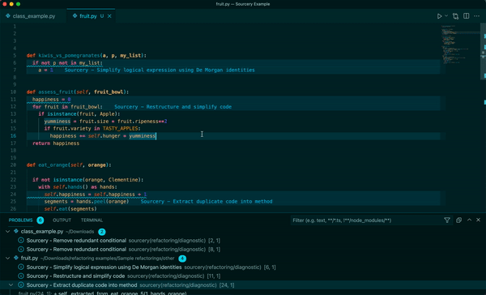

### Accept a Suggestion

To accept a suggestion you can:

- Press the quickfix shortcut (typically `Ctrl .` or `Cmd .`) when you have
  selected the underlined line and then choose to apply the refactoring
- Click on the lightbulb icon next to the underlined line and then select to
  accept the refactoring
- Open the Problems pane, right click on the suggested refactoring, and accept
  the suggested change.

### Skip a Suggestion

You can skip a Sourcery suggestion once by choosing the skip option from the
Sourcery action items menu:

- Press the quickfix shortcut (typically `Ctrl .` or `Cmd .`) when you have
  selected the underlined line and then choose to skip the refactoring
- Click on the lightbulb icon next to the underlined line and then select to
  skip the refactoring
- Open the Problems pane, right click on the suggested refactoring, and select
  to skip the refactoring.

You can also tell Sourcery not to suggest all refactorings or a specific type of
refactoring for a function.

- Add a comment `# sourcery skip` to a function to skip all reactorings for that
  function
- Add a comment `# sourcery skip: <refactoring-id>` to a function to skip the
  specific refactoring in that function. A full list of refactorings and their
  IDs are available at [Current Refactorings](https://docs.sourcery.ai/refactorings/index.md).

### Permanently Ignore a Type of Refactoring

You can choose to never see a certain type of refactoring when it is suggested
to you by Sourcery. Bring up the Quick Fix menu and select the third menu item
`Sourcery - Never show me this refactoring`.

Sourcery will then add this refactoring to your list of
[excluded refactorings](https://docs.sourcery.ai/Configuration/Customizing-Refactorings/). You can
reverse this by going to your project's sourcery.yaml file and removing the
refactoring from the `skip` list.

### See Code Quality Metrics

Sourcery gives each of your functions a quality score on 4 different metrics:

- **Complexity**
- **Method Length**
- **Working Memory**
- **Overall Quality**

To see the metrics for any function, simply hover your mouse of the line
defining the function and the Sourcery metrics will pop up. Each metric will
have a numeric score, along with a quick qualitative guide ranging from bad to
excellent.

Sourcery will also automatically flag functions with too low of an overall
quality score. By default this is set for functions with a quality score under
25%, but you [can adjust this threshold](https://docs.sourcery.ai/Configuration/).
