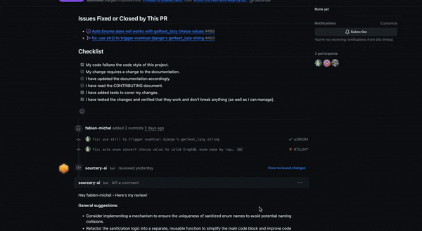

You can add Sourcery to your GitHub or GitLab repos to get immediate code review feedback on every pull/merge request.

## GitHub Code Reviews
You can [directly add the Sourcery GitHub integration](https://github.com/apps/sourcery-ai/installations/new ) to any repo.

## GitLab Code Reviews
You can run Sourcery code reviews as part of your CI to get reviews on every GitLab MR. [Follow the instructions in our documentation](https://docs.sourcery.ai/Code-Review/Getting-Started/GitLab/) to set up Sourcery for GitLab.

## Code Reviews for Other Platforms
Sourcery is not yet available for Bitbucket or other platforms, but you can [sign up for our waitlist](https://research.typeform.com/to/GoVM9jYf) to get early access when it's available. 