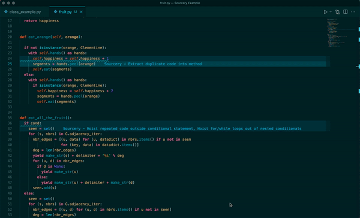

## 30 day free trial of Sourcery Pro

Sourcery Pro includes more advanced features helping you to refactor private
GitHub repos, analyse and refactor multiple files at once in your IDE, detect
duplicate (and near duplicate) code, and includes advanced refactorings.

Everyone who signs up for Sourcery gets 30 days of free trial access to Sourcery
Pro. After those 30 days you need to [upgrade](https://sourcery.ai/pro/) to
continue using the Sourcery Pro features.

### Getting Your Token

To get your token go to your
[Sourcery Dashboard](https://sourcery.ai/dashboard)) and copy the token.

Then return to VS Code and enter the token in the text box that prompts you on
install.

If you do not see the Sourcery prompt to enter your token then open up
Preferences > Settings > Extensions > Sourcery Configuration and enter the token
in the input box.

