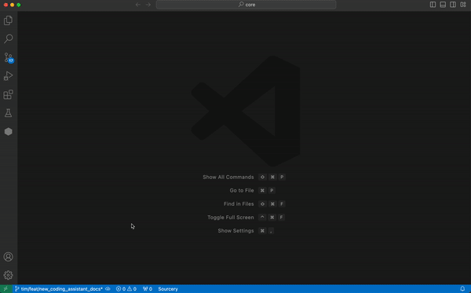

## Use Sourcery on all your code
You can use Sourcery on open source code for free. In order to use it on closed source projects you'll need to sign up for a [Sourcery Pro account](https://sourcery.ai/signup/?utm_source=VS-Code).

## 14 day free trial of Sourcery Pro

You can sign up for a 14 day free trial of Sourcery Pro (no credit card required) to try out Sourcery on all of your projects.

After those 14 days you can choose to upgrade to Pro or you can keep using Sourcery for Free for open source projects. 

## Free for students and educators

Sourcery is free to use for students and educators on open source and closed source projects. Email us at [students@sourcery.ai](mailto:students@sourcery.ai) and we'll get you set up with a free plan. 

### Log In

After [signing up](https://sourcery.ai/signup/?utm_source=VS-Code), log in by
opening the command palette (Ctrl/Cmd+Shift+P) and executing the
`Sourcery: Login` command. Or open the Sourcery sidebar (click our hexagonal logo) and click the log in button.

### Opting Into Sourcery's Coding Assistant

There are two main ways you can use Sourcery as a pair programmer. One is through our rules-based in-line suggestions that run fully locally and that you'll see appear in your code. The other is through our Coding Assistant which you can ask questions to, can write new code or update your existing code, and more. The Coding Assistant relies on third party large language models and you need to opt into using it before you can start. 

To opt into use the Coding Assistant, open the Sourcery sidebar, and click the Opt In button. If you choose not to opt in, you can still use the rules-based suggestions from Sourcery fully locally
