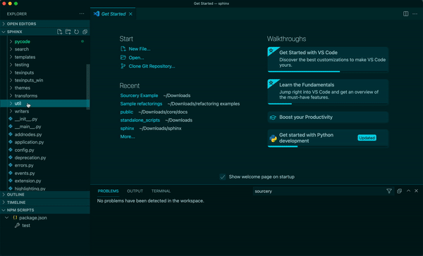
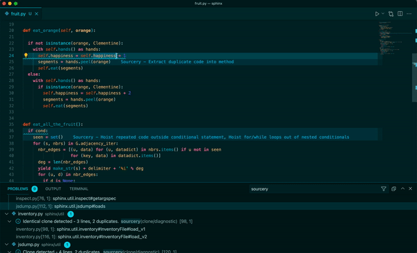

## Sourcery Pro Free Trial

### Full Project or Multi-File Code Review

You can have Sourcery review multiple files, a folder, or an entire project at
once:

- Right click on the folder or file you're interested in.
- Hover over the Sourcery menu item and select "Scan with Sourcery"
- Suggestions will appear in the Problems pane

### Detect Duplicate (and Near Duplicate) Code

Sourcery can help you find duplicate sections of code across your project.

- Right click on files or folders in the Explorer window
- Hover over the Sourcery menu item and select "Detect clones"
- A list of duplicate and near duplicate sections of code will appear in the
  Problems pane.

By default Sourcery will flag exact duplicates as well as near duplicates
(sections of code that almost match, except for some altered parameters).

### Extract Duplicate Code Into Methods

Sourcery will automatically detect opportunities for repeated or nearly repeated
sections of code within a function to be extracted out into their own methods.
When these refactorings are suggested, the new methods will be given a generic
name based on the function it was extracted from and you can easily rename it.

### Sourcery in Private GitHub Repos

For Sourcery Pro users, Sourcery is able to analyze and refactor all public and
private individual repos.

See our section on [GitHub Usage](https://docs.sourcery.ai/GitHub/Using-Sourcery-for-GitHub.md) for
more details on how to use Sourcery for GitHub.

A [Sourcery Team plan](https://docs.sourcery.ai/Sourcery-Team.md) is required to use Sourcery for
private repos for a GitHub organization.

### Sourcery for Students

Students learning Python are able to get 12 months of free access to Sourcery
Pro. Please email [students@sourcery.ai](mailto:students@sourcery.ai) and we'll
help you get set up.
