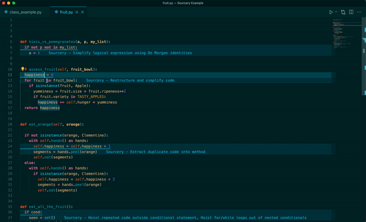

## Finding Your First Refactoring

Sourcery continually checks your code and looks for opportunities to refactor it
to make it clearer, cleaner, and easier to work with. In your IDE, Sourcery will
underline or highlight any section of code where it can make a refactoring. 

### In the tutorial

Once you open the tutorial you should see this example:

```
def refactoring_example(spellbook):
    result = []
    for spell in spellbook:
        if spell.is_awesome:
            result.append(spell)
    return result
```

You should see Sourcery immediately highlight the `result = []` line with a
refactoring suggestion.

Hover your mouse over the underlined section to see a description of the change
and a diff of Sourcery's refactoring.

To accept one of Sourcery's changes, bring up the code actions/quick fix menu,
and choose to apply the changes. Or you can click on the lightbulb icon to apply
the changes.



You can also bring up all of the changes Sourcery is suggesting to your open
files by opening up the Problems window.

